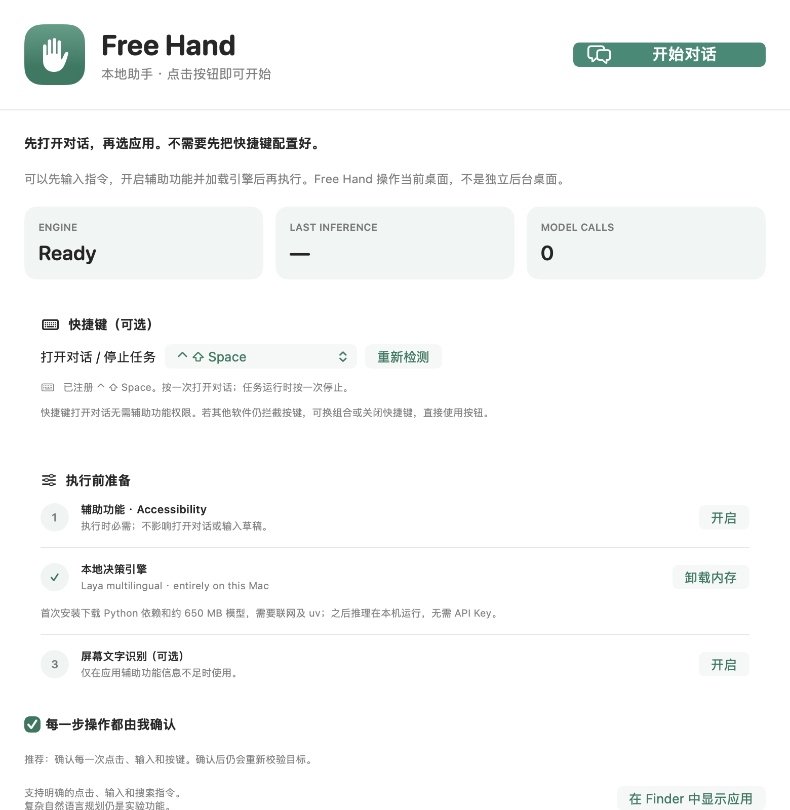

# Free Hand

**A helping hand. Not a cloud.**

[简体中文](README.zh-CN.md) · [Architecture](docs/ARCHITECTURE.md) · [Development](docs/DEVELOPMENT.md) · [Validation](docs/VALIDATION.md)

A local-first macOS desktop assistant that combines **Third Hand's native app
control** with **Laya-MLX's on-device typed decisions**. Click **开始对话 (Start
conversation)**, select the application to control, enter a task, and review the
proposed actions. The optional default shortcut is **Control–Shift–Space**.

> **Developer preview:** exact click/type/search commands have a deterministic,
> observed-control path. Open-ended model planning is experimental and currently
> fails some retained accuracy fixtures. This is not an unattended autonomous
> desktop agent. See [actual validation results](docs/VALIDATION.md).

No cloud model, API key, account, HTTP inference server, or hidden cloud fallback.
The first installation needs internet; subsequent inference uses the downloaded
checkpoint entirely on your Apple Silicon Mac.



## What is implemented

| Capability | v0.1.1 |
| --- | --- |
| Native setup button, menu-bar entry, task conversation | Always opens, even before permission/model setup |
| Application picker, draft and result history | Explicit process identity; in-memory session only |
| Configurable global shortcut | Ctrl–Shift–Space by default; conflict status, alternatives, disable switch |
| Chinese and English task input | Literal commands plus a pinned multilingual Laya checkpoint |
| Observe native applications | macOS Accessibility, with optional Apple Vision OCR |
| Click, scroll, type exact supplied text, Return/Tab/Escape | Observed targets; no arbitrary tool or shell generation |
| Local inference | Resident Python/MLX process over bounded private stdin/stdout |
| Review before input | Every action by default; one-time approval tied to current target |
| Cancellation and focus changes | Stop shortcut, stop button, timeouts, stale-decision rejection |
| Task verification | Exact value/action checks for literal commands; separate model completion check for other tasks |
| Model setup | In-app installer, pinned dependencies, explicit download, checksum verification |
| Diagnostics | Native `--doctor`, engine doctor, real-inference smoke tests |
| Safe practice app | Disposable native Playground, no network or personal data |
| Windows/Linux, isolated background desktop, writing generation | **Not supported** |

This is an initial developer release, not a universal autonomous computer-use agent.
The small decision model chooses from observed options; it does not generate
writing or invent commands. Keep tasks short and supply text in quotes. Model
completion checks are predictions, not a guarantee of correctness.

## How the two systems work together

The native controller interprets a strict, small grammar for exact commands such
as `Click Settings`, `输入“你好”`, or `Search for "Adele"`. It only uses an exact
unique control label, a unique/focused editable field, or a unique search field.
Those commands do **not** need a model call to reinterpret an already explicit
instruction. They still pass the same approval, focus, stale-target and input
validators. Search submission and whole-task completion are separate steps.

For commands outside that grammar or targets that are not unambiguous, Laya
selects from the currently observed action/target options. That semantic path
remains experimental: real tests exposed incorrect abstentions and premature
completion choices. Model-free command tests are not reported as model accuracy.
The failing model-only checks remain executable and visible in the validation
record; no cloud fallback masks them.

## Quick start

Requirements: **Apple Silicon**, macOS **14+**, Xcode Command Line Tools / Swift
5.9+, `git`, and [`uv`](https://docs.astral.sh/uv/getting-started/installation/).
No separately installed Python is needed: uv provisions Python 3.12. Allow space
for the model, Python, dependencies, and build output; the checkpoint alone is
roughly 650 MB. Setup downloads executable dependencies from PyPI/GitHub and a
model from Hugging Face; normal inference does not.

```bash
git clone https://github.com/ziyu/free-hand.git
cd free-hand

# Install a private Python runtime and the pinned multilingual model.
bash Scripts/setup-runtime.sh

# Explicit local developer build; not a notarized public distribution.
bash Scripts/build.sh --development --install
open "Free Hand.app"
```

With a valid Apple signing certificate, omit `--development` and set
`FREEHAND_SIGNING_IDENTITY` to its fingerprint on the first build. Updates preserve
the pinned identity. Ad-hoc development updates may require granting permissions
again. Never modify TCC databases or disable Gatekeeper to use this project.

In the setup window, enable **Accessibility** for this exact `Free Hand.app`.
Screen Recording is optional, used only when an application exposes too little
accessibility information. Follow macOS's quit/reopen instruction when requested.
The model can also be installed or repaired from the setup window once uv exists.

Click **开始对话** at the top of the main window or in the menu bar. Select a
running app under **操作应用**, enter a command, then click **发送指令** or press
**Command–Return**. The conversation can open and retain a draft before
Accessibility or the model is ready; sending waits for both, with visible setup
buttons. No task is silently queued when permissions change.

Alternatively, focus the target application and press **⌃ ⇧ Space**. The
shortcut now uses native hotkey registration instead of a permission-gated
global event tap. Settings offer alternate combinations (including the old
Ctrl–Option–Space), a disable option, and retry/conflict status. System-reserved
and exclusive-registration conflicts are detected; arbitrary keyboard-remapping
utilities may still intercept a chord, so the button remains the primary entry.

Examples:

```text
Click Settings
Search for "Adele"
Type "Hello Free Hand"
点击设置
输入“你好”
```

Approve with **Allow once**, or select **Stop task**. The shortcut also cancels a
running task. Opening the conversation during a task stops that task before
bringing our window forward. Each message is an independent task, not general
LLM chat or implicit continuation. Changing the frontmost app stops automation. Free Hand controls
your **current desktop**, including its pointer and keyboard; this is **not** a
separate user session or a non-interfering virtual desktop.

## Practice without touching your work

```bash
bash Scripts/playground.sh
```

This opens a dedicated native window with a search field and a Dark mode toggle.
Use Free Hand there first. The Playground has no network, persistent files, or
accounts. Keep **Review every action** enabled.

## Privacy and safety boundaries

Accessibility text and optional OCR are processed locally. Inference runs over
parent-owned pipes; there is no listening port. No task, screen text, screenshot,
or typed content is persisted in the app's logs. The task conversation keeps up
to 40 user instructions and their result/status messages in memory. Drafts and
history disappear on quit; shortcut selection and review mode are preferences.

Models and runtimes live in `~/Library/Application Support/Free Hand/`. A standard
setup may also use uv's package cache and Hugging Face's download metadata. The
app holds the model in memory while loaded; use **Unload** to release it.

Default review covers every mutating action. Optional navigation auto mode is
**not a security boundary**: risk labels are heuristics, and unexpected UI can be
misclassified. Text, Return, OCR clicks, terminal input and recognized sensitive
controls still require review. Secure accessibility fields are excluded, but
arbitrary custom-drawn widgets cannot be classified perfectly. Screen contents
are untrusted, and prompt injection is not solved by a local model. Do not run
unattended on purchases, messages, financial accounts, permissions, or deletion.

Free Hand refuses missing/disabled/unoffered targets, stale windows, uncertain
choices, oversized tasks, question-option truncation, and repeated failed
actions. Limits: 30 actions, 40 planning cycles, three minutes, 20 seconds per model
request. Waiting for approval counts toward the task deadline. If a request is
cancelled while inference is busy, the worker is stopped; reload it from setup.

## Development and tests

```bash
swift test
uv run --project engine --extra dev pytest engine/tests
uv run --project engine --extra dev ruff check engine Scripts/smoke-model.py

# Real MLX inference on synthetic, nonprivate screen observations.
# Model-only accuracy diagnostic: currently returns nonzero for known failures.
uv run --project engine python Scripts/smoke-model.py

# Production Swift -> Python -> MLX pipe test. No desktop input is sent.
FREEHAND_LIVE_TESTS=1 \
FREEHAND_PYTHON="$PWD/engine/.venv/bin/python" \
swift test --filter LiveEngineTests

# Retained model-only planning regressions, independently of literal routing.
# Currently expected to fail; this is NOT a claimed green accuracy benchmark.
FREEHAND_EXPERIMENTAL_ACCURACY=1 swift test --filter testExperimentalModelOnlyAccuracy

# Actual installed application identity and macOS permission state.
"Free Hand.app/Contents/MacOS/FreeHand" --doctor
```

Unit tests do not prove permission-gated real-app control. See
[Validation](docs/VALIDATION.md) for exactly what was run and what remains manual.

## Upstream projects and licensing

Native control is adapted from [shhivv/third-hand](https://github.com/shhivv/third-hand)
(MIT). The pinned inference dependency is
[mizorewww/laya-mlx](https://github.com/mizorewww/laya-mlx) (Apache-2.0), derived
from Laya. Free Hand replaces the cloud selector, removes key management and CDP
discovery, changes completion/recovery semantics, adds bounded local inference,
and provides its own setup and review UI. It is not an official release of either
upstream project.

Free Hand's original code is MIT. Derived code and dependencies retain their
licenses. See [NOTICE](NOTICE) and [ThirdParty](ThirdParty/), including exact source
revisions and model SHA-256. Model weights are downloaded separately and are not
relicensed by this repository.
